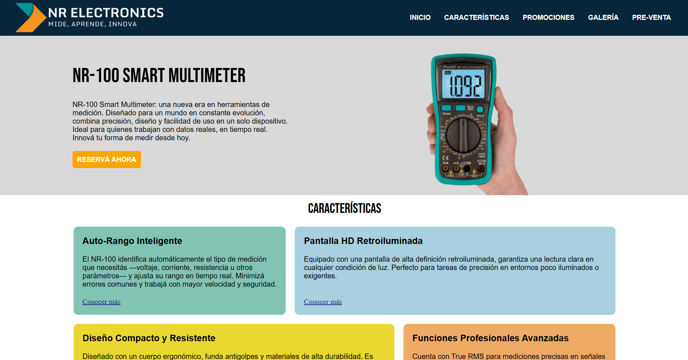

# NR-100 Smart Multimeter – Landing Page

Landing page desarrollada como obligatorio del curso de **Diseño de Interfaces Web** (primer semestre – Analista en TI). El proyecto presenta el multímetro NR-100, con foco en estructura semántica, diseño responsive y buenas prácticas de HTML5 y CSS3.



---

## 🧩 Características del proyecto

- Maquetación completa con **HTML5 semántico**
- Estilos responsivos en **CSS3**
- Fuentes importadas desde Google Fonts (Bebas Neue e Inter)
- Secciones: Inicio, Características, Promociones, Galería y Pre-venta
- Formulario con validaciones nativas de HTML
- Tabla comparativa accesible
- Imágenes optimizadas en carpeta `/img`

## 📂 Estructura del proyecto
/
├── index.html
├── css/
│   └── styles.css
├── img/
│   ├── nr100-1.jpg
│   ├── nr100-2.jpg
│   ├── nr100-3.jpg
│   └── ...
└── README.md


## 🚀 Cómo visualizar el proyecto

1. Cloná el repositorio:  
   ```bash
   git clone https://github.com/tu-usuario/nr100-landing-page.git
2. Abrí index.html en cualquier navegador.
